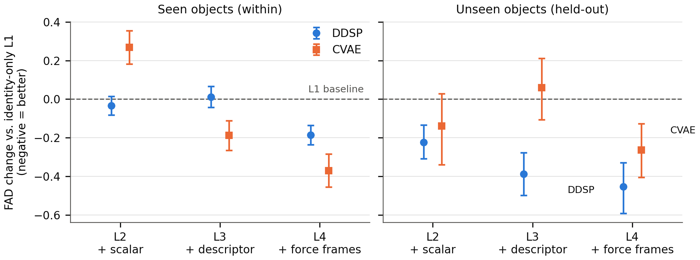

# Force Granularity in Neural Impact-Sound Generation

**Project page** (audio examples, full result tables): [bzfll.github.io/force-conditioned-impact-sound](https://bzfll.github.io/force-conditioned-impact-sound/)

Companion code for the paper *How Much Impact-Force Detail Does Neural
Impact-Sound Generation Use?*. Two generators — a
filterbank-DDSP model and a conditional mel-spectrogram VAE — are trained
on four nested force representations (identity only → + peak-force scalar →
+ 6-D descriptor → + time-resolved force frames), on ObjectFolder-Real
(100 objects, 3,548 strikes, seen- and unseen-object splits).



## Setup

```bash
pip install -r requirements.txt         # evaluation environment, Python 3.14
pip install -r requirements_train.txt   # training environment (GPU)
export PYTORCH_ENABLE_MPS_FALLBACK=1    # only on the MPS backend (macOS)
```

## Data

ObjectFolder-Real (Gao et al., CVPR 2023) is not redistributed; download it
from the [official project page](https://objectfolder.stanford.edu/) and
point the code at it:

```bash
export OFR_ROOT=/path/to/ObjectFolder_Real                # per-object impact folders
export OFR_OBJECTS_CSV=/path/to/ObjectFolder/objects.csv   # object -> material map
```

The splits used in the paper are in `splits/` (seed 42).

## Training

```bash
python3 src/train.py --backbone ddsp --split within --ablation 4 --seed 42 \
        --save_dir experiments/ablation_4_within_ddsp_s42
```

`--ablation 1..4` selects the conditioning level, `--backbone {ddsp,cvae}`
the generator, `--split {within,heldout}` the seen/unseen-object split.
`scripts/run_grid_*.sh` launch the full grids. Each run directory under
`experiments/` carries the `config.json` it was trained with.

The two training-side variants of Table 2 (DDSP, ablation 4):

```bash
# envelope-L1 auxiliary loss (held-out split)
python3 src/train.py --backbone ddsp --split heldout --ablation 4 --seed 42 \
        --env_lambda 8.8 --save_dir experiments/envloss/envloss_heldout_L4_s42

# synthetic-IR pretraining, then fine-tuning on the real splits
python3 src/make_synthetic_ir_pool.py   # one-time: 2,000 simulated room IRs
python3 src/train.py --backbone ddsp --split heldout --ablation 4 \
        --epochs 300 --synthetic \
        --save_dir experiments/pretrain/pretrain_synthetic
python3 src/train.py --backbone ddsp --split heldout --ablation 4 --seed 42 \
        --init_from experiments/pretrain/pretrain_synthetic/best_model.pt \
        --save_dir experiments/pretrain/ft_heldout_L4_s42
```

`scripts/run_grid_envloss_pretrain.sh` runs these cells.

Force-representation names used in the code and the run directories:

| Code name (`--feature_set`) | Paper name | Dim. | Run-dir suffix |
|---|---|---|---|
| `v1` | original 6-D descriptor (peak, FWHM, bounce count, max bounce ratio, decay constant, asymmetry); L2 uses its dimension 0 | 6 | none |
| `impulse` | fair 1-D scalar (L2′: integral of the force magnitude) | 1 | `_impulse` |
| `v2A` | corrected core descriptor (L3′_A: peak, contact duration, asymmetry) | 3 | `_v2A` |
| `v2AB` | corrected 6-D descriptor (L3′_AB: v2A + impulse, bounce count, max bounce ratio) | 6 | `_v2AB` |
| `pca6` | PCA-6 summary (scores on a train-split PCA basis of the force curve) | 6 | `_pca6` |

## Evaluation

Evaluation expects `best_model.pt` (written by `src/train.py`) in each run
directory under `experiments/`; run the training grids above first. The
envelope-loss and pretraining variants of Table 2 are evaluated from their
run directories under `experiments/envloss/` and `experiments/pretrain/`,
whose `env_config.json`, `pretrain_config.json` and `finetune_config.json`
record their training configuration.

```bash
bash scripts/eval_test_main.sh               # Table 1
python3 src/evaluate_ladder.py --split within --pca6
python3 src/evaluate_ladder.py --split heldout
python3 src/plot_ladder_main.py              # Figure 1 (from the ladder result files)
python3 src/eval_val_fad.py --split within   # Table 2
python3 src/eval_val_fad.py --split heldout
python3 src/modal_baseline_eval.py
python3 src/whitenoise_baseline.py
```

If the VGGish encoder cannot be downloaded, the evaluator
falls back to a log-mel encoder and marks outputs `fad_encoder_compliant:
false` — such results are not comparable with the paper.

`pytest` runs the test suite (no dataset or checkpoints needed).
